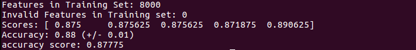

## 3D Perception Robot

***Feature-rich 3D perception with a PR2 robot using an RGBD camera***

<p align="">

</p>

This project originated from Udacity's [PR2 3D Perception Project](https://github.com/udacity/RoboND-Perception-Project).

### Task 
Object recognition of target objects from a collection of various objects in a cluttered environment.

### Criteria
Minimum critera for object recognition in each test scene of RViz simulation is as follows:

* test1.world - 100% (5/5)
* test2.world - 80% (4/5)
* test3.world - 75% (6/8)

### Setup
Create a ROS catkin workspace if haven't alreay

```sh
$ mkdir -p ~/catkin_ws/src
$ cd ~/catkin_ws/
$ catkin_make
```

Clone or or download this repo into the src directory of your workspace
```sh
$ cd ~/catkin_ws/src
$ git clone https://github.com/Salman-H/3d-perception-robot.git
```
Install missing dependencies using rosdep install
```sh
$ cd ~/catkin_ws
$ rosdep install --from-paths src --ignore-src --rosdistro=kinetic -y
```
Build the project
```sh
$ cd ~/catkin_ws
$ catkin_make
```
Add following to your .bashrc file
```
export GAZEBO_MODEL_PATH=~/catkin_ws/src/RoboND-Perception-Project/pr2_robot/models:$GAZEBO_MODEL_PATH
```

Add following to the .bashrc to auto-source all new terminals
```
source ~/catkin_ws/devel/setup.bash
```
### Implementation

To process camera image point cloud with python-pcl, it needs to be converted from a ROS message (in PointCloud2 format) to a PCL format. Subsequently, it is fed into the perception pipeline consisting of the following three main steps:

##### 1. Filtering and RANSAC plane fitting
The following filters are applied to the input point cloud in project_template.py:

1. Statistical Outlier Removal Filter
2. Voxel Grid Downsampling
3. Passthrough Filter
4. RANSAC Segmentation

The statistical outlier filter removes noise from the image pcl cloud. Any point with a mean distance larger than global mean distance + some threshold*std_dev is considered an outlier. Since there is  considerable noise in the incoming image, the threshold value is lowered as much as possible without removing desired object cloud data. Next, the image is downsampled using a voxel grid to save on memory and computational resources required to process the pcl image cloud. The voxel grid's leaf size is reduced accordingly through tweaking so that it's not reduced to a point where useful image data is lost. Subsequently, a pass-through filter is applied in the z and y directions to remove the table stand and drop-boxes and isolate only the tabletop and its objects. Finally, to obtain an object-only cloud, the tabletop is segmented from the objects with a RANSAC (Random Sample Consensus) plane segmenter. The maximum distance for a point to be considered fitting the RANSAC model (a plane) is obtained by trying different values.

##### 2. Clustering for Segmentation
The object cloud obtained from the previous process is clustered into individual objects using Euclidean clustering. The k-d tree data structure is used in the Euclidean Clustering algorithm to decrease the computational burden of searching for neighboring points. While other efficient algorithms/data structures for nearest neighbor search exist, PCL's Euclidean Clustering algorithm only supports k-d trees.The clustering parameters of min/max cluster size and cluster tolerance are tweaked to find values that work for segmenting objects. The k-d tree is then searched for clusters and indices extracted for each of the discovered clusters to create a cluster-mask Point Cloud to visualize each cluster separately. A new pcl cluster cloud is created containing all segmented object clusters in the scene, each with a unique color assigned to it for identification. The pcl cloud is then converted back to ROS messages which are published to the various ROS topics and visualized in RViz as shown below.


##### 3. Feature Extraction, SVM Training, Object Recognition
The last step is to classify each detected cluster (in the previous step) by its predicted identification label. To achieve this, first a classification model is trained on a set of objects of interest using an RGB-D camera in the Gazebo simulation environment using the capture_features module. The trained model is then used by the pr2_robot package for object recognition. For each detected object, its features are obtained from computing color histograms. 

*Note:* a color histogram can be used to obtain features for identifying objects in a segmented point cloud and a classifier trained on this feature set to recognize some object of interest in the point cloud.

An HSV color space is used, as opposed to an RGB, as it is more resistant to lighting changes and more suited to perception tasks in robotics. A range of [0, 256] and [-1, 1] is used for computing the color and normal histograms respectively with 32 bins used for each which results in reasonable accuracy without overfitting. The HSV histograms are concatenated into a single feature vector and normalized. A SVM (Support Vector Machine) algorithm is trained on the captured features with over 1000 camera shots used resulting in a training accuracy of 88%.



Confusion matrices from training:


### Results
The output yaml files 1, 2, 3 correspond to test worlds 1, 2 and 3 respectively. Object recognition results from these test worlds are shown below. All objects in test1.world and test2.world are correctly classified. Only 1 object in test3.world, sticky_notes, is sometimes misclassified as soap2.
<br>

<br>

<br>


### Improvements
By using hsv color histograms and increasing the number of training iteration to 1000, an 88% accuracy is achieved from the classifier. It can be observed from the normalized confusion matrix that the lowest object-recognition accuracy results from stick_notes which are correctly classified 83% of the time whilst remaining times often misclassified as glue or soap2. Since the aforementioned objects appear similar in shape and dimensions more so than other objects in the scene, increasing the number of training iterations should help improve the accuracy of the model, as would more noise filtering in the perception pipeline. The project should also be expanded by implementing PR2 pick-and-place operation.
   
