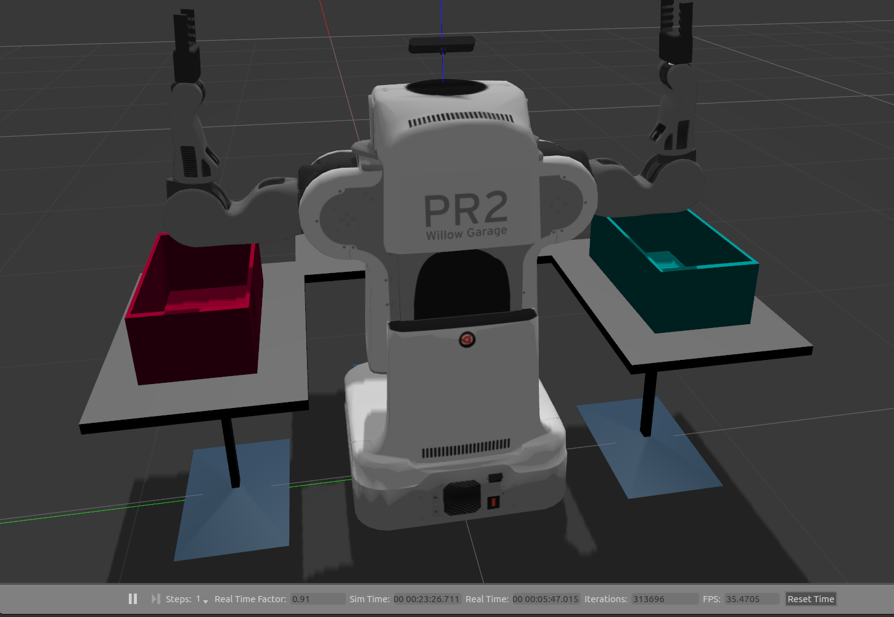
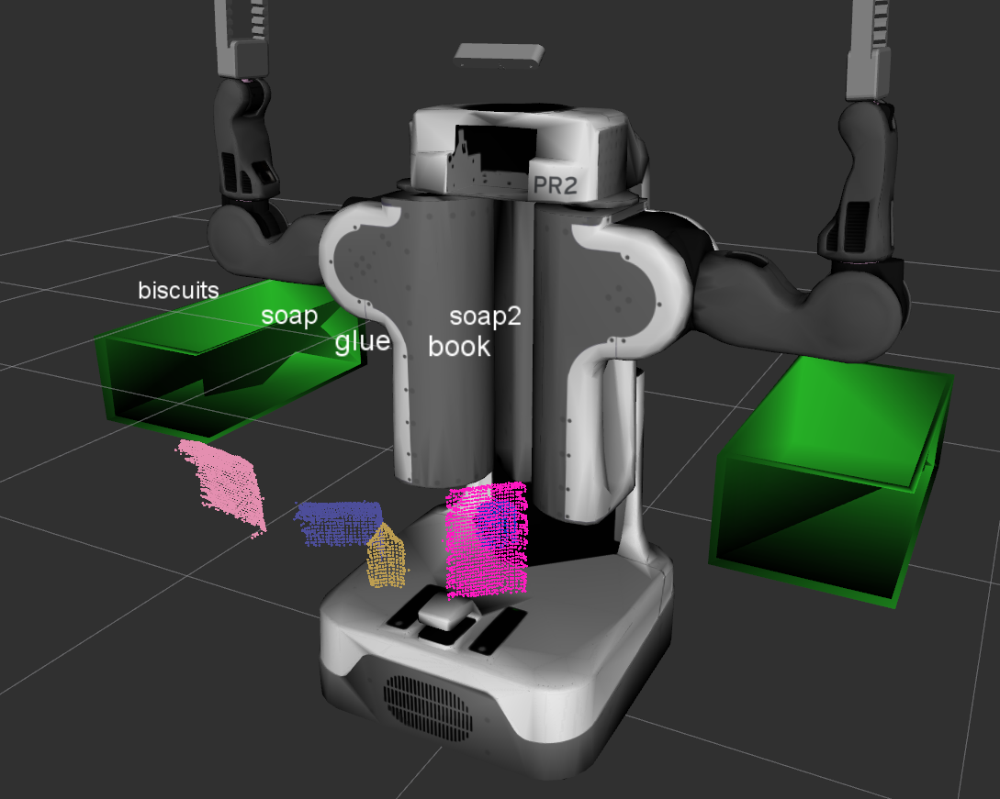
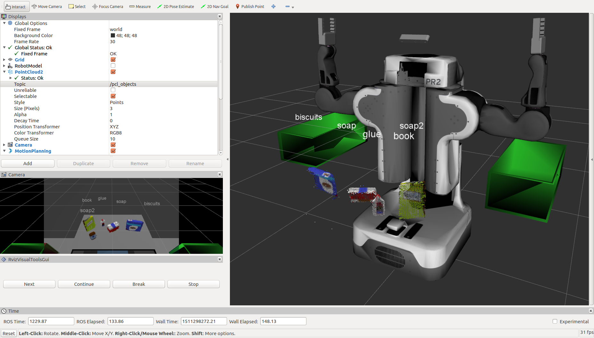
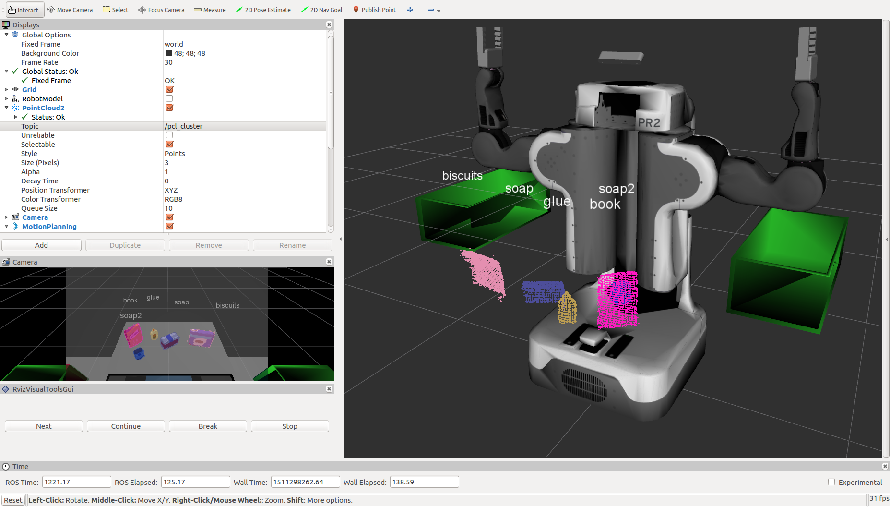
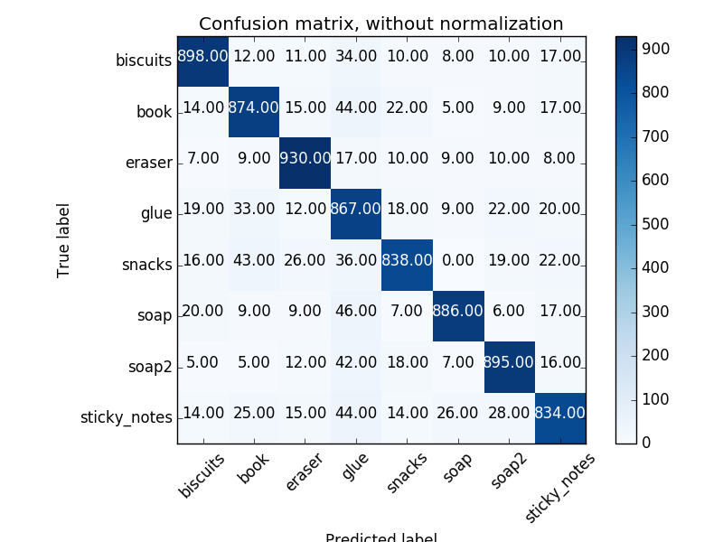
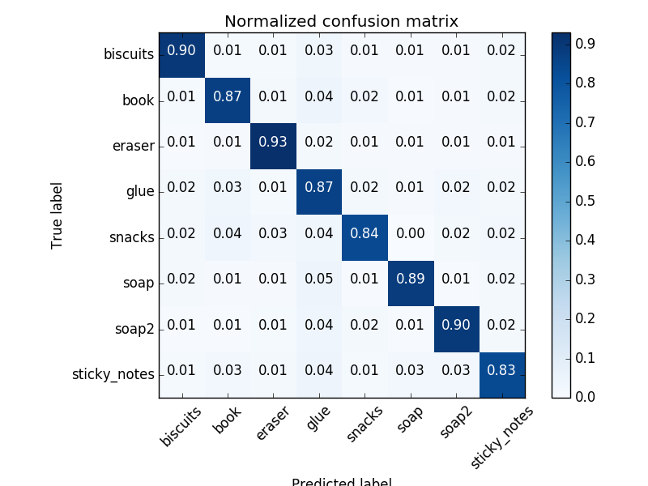
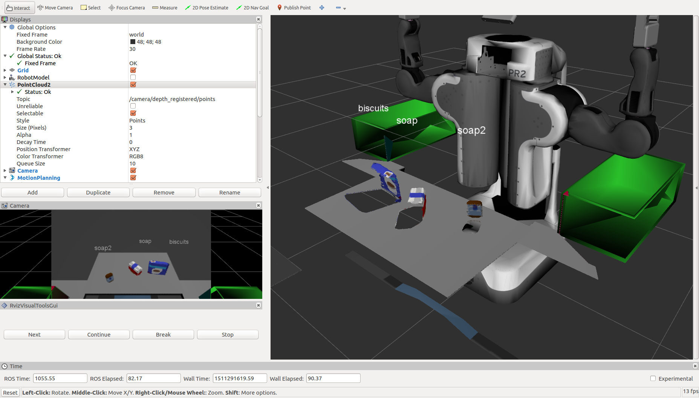
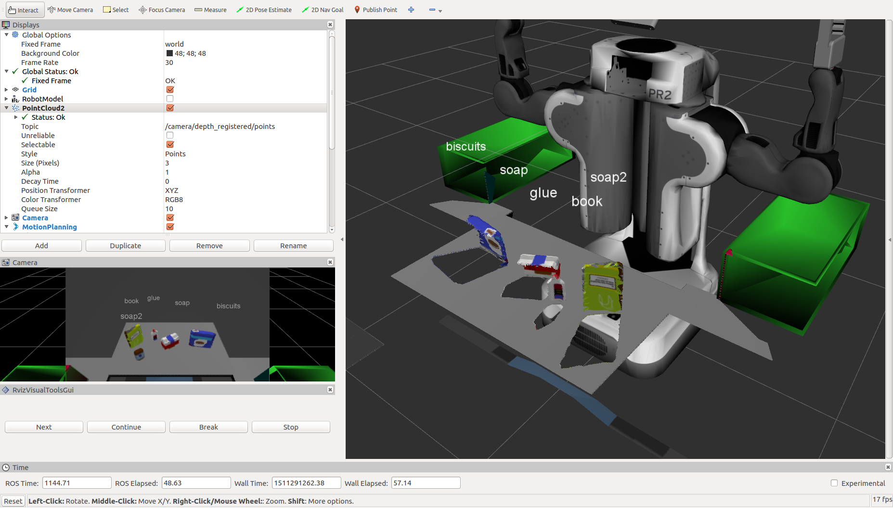
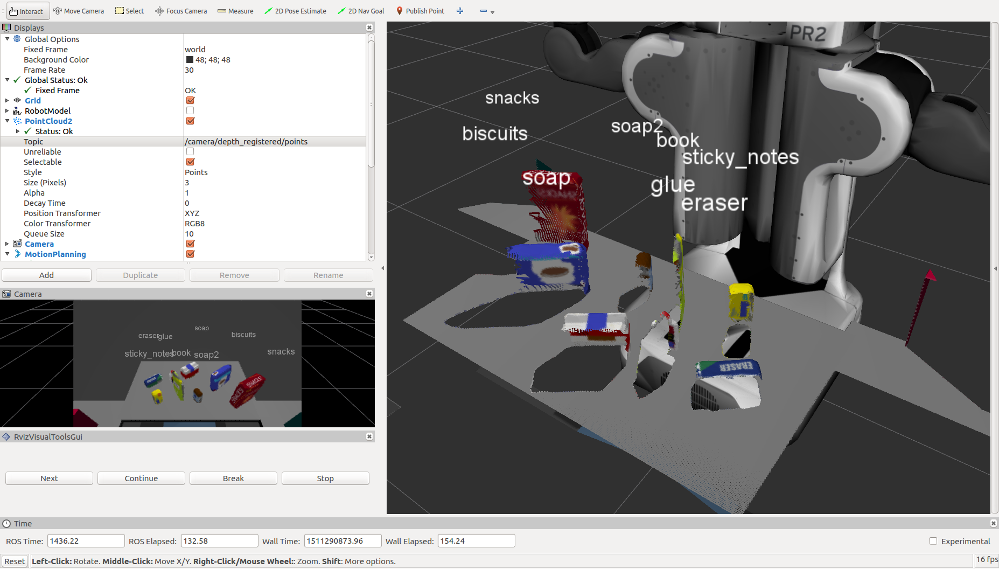

## 3D Perception Robot

***Feature-rich 3D perception with a PR2 robot using an RGBD camera***

<p align="">

</p>

This project originated from Udacity's [PR2 3D Perception Project](https://github.com/udacity/RoboND-Perception-Project).

### Task 
Object recognition of target objects from a collection of various objects in a cluttered environment.

### Criteria
Minimum critera for object recognition in each test scene of RViz simulation is as follows:

* test1.world - 100% (5/5)
* test2.world - 80% (4/5)
* test3.world - 75% (6/8)

### Setup
Create a ROS catkin workspace if haven't alreay

```sh
$ mkdir -p ~/catkin_ws/src
$ cd ~/catkin_ws/
$ catkin_make
```

Clone or or download this repo into the src directory of your workspace
```sh
$ cd ~/catkin_ws/src
$ git clone https://github.com/Salman-H/3d-perception-robot.git
```
Install missing dependencies using rosdep install
```sh
$ cd ~/catkin_ws
$ rosdep install --from-paths src --ignore-src --rosdistro=kinetic -y
```
Build the project
```sh
$ cd ~/catkin_ws
$ catkin_make
```
Add following to your .bashrc file
```
export GAZEBO_MODEL_PATH=~/catkin_ws/src/RoboND-Perception-Project/pr2_robot/models:$GAZEBO_MODEL_PATH
```

Add following to the .bashrc to auto-source all new terminals
```
source ~/catkin_ws/devel/setup.bash
```
###Implementation

The Perception pipeline consists of the following steps:

##### Filtering and RANSAC plane fitting
The following filters are applied to the input point cloud in project_template.py:

1. Statistical outlier removal filter
2. Voxel grid downsampling
3. Passthrough filter
4. RANSAC segmentation to segment table from objects

##### Clustering for Segmentation
The following steps are used to segment individual objects in project_template.py:

5. Euclidean clustering to obtain individual objects
6. Classification of each detected cluster by its predicted label




##### Feature Extraction, SVM Training, Object Recognition
The following steps are used to segment individual objects:

7. Train a classification model on a set of objects of interest using an RGB-D camera. The trained model can then be used by the pr2_robot package for object recognition.
8. Obtain object features from color histograms. A color histogram can be used to obtain features for identifying objects in a segmented point cloud. A classifier then can be trained on this feature set to recognize some object of interest in the point cloud. An HSV color space is used, as opposed to an RGB, as it is more resistant to lighting changes and more suited to perception tasks in robotics.
9. Compute and concatenate HSV color histograms into a single feature vector and compute normalized HSV histograms in features.py.
10. Capture model features with RGBD camera for training set in capture_features.py.
11. Tran an SVM (Support Vector Machine) algorithm on captured features in capture_features.py.
12. Camera shots are increased to 1000 in the photograph_models() method of  capture_features.py to improve training quality.

Confusion matrices from training:





### Results
Object recognition results from test worlds 1, 2 and 3 respectively are shown below. All objects from each of the three world scenes is identified. 
<br>

<br>

<br>


### Improvements
Training can be improved by tuning the SVM parameters such as number of model snapshots. The project can be expanded by implementing pick-and-place kinematics.
   
